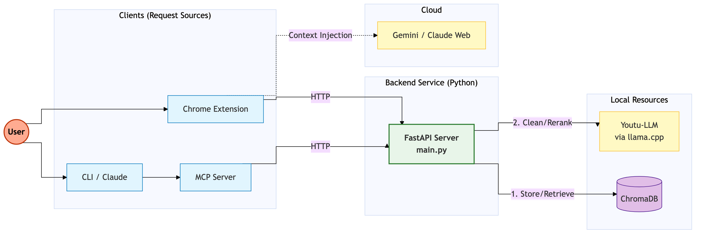

# Gemini Memory Bridge (第二大脑)

**Gemini Memory Bridge** 是你 Google Gemini 网页版聊天的“第二大脑”。它打通了网页聊天与本地持久化向量数据库的连接，让 Gemini 能够跨会话记住事实、偏好和上下文。

本项目现已采用中心化 API 架构，支持 **Chrome 插件** 和 **MCP (Model Context Protocol) Agent** 共同读写同一份记忆。



## ✨ 核心功能

-   **自动记忆捕获**:
    -   自动保存你的输入和 Gemini 的回复。
    -   **智能过滤**: (开发中) 自动过滤简短的闲聊。
-   **上下文注入 (RAG)**:
    -   打字时实时进行语义搜索。
    -   在发送消息前，自动将最相关的历史记忆注入到 Prompt 中。
-   **隐私与控制**:
    -   **暂停/恢复**: 插件端提供全局开关，一键停止录制。
    -   **记忆管理**: 点击插件图标即可查看当前相关记忆，并可直接删除。
    -   **本地优先**: 所有数据存储在本地 `ChromaDB`，完全掌控隐私。
-   **MCP 支持**:
    -   可连接 Cursor, Claude Desktop 等 MCP 客户端。
    -   提供工具: `search_memory`, `save_memory`, `delete_memory`。

## 🛠 技术架构

项目由三部分组成：

1.  **中心服务端 (FastAPI)**: 管理 ChromaDB 向量库，提供 HTTP API (`/api/search`, `/add_memory`, `/api/delete`)。
2.  **Chrome 插件**: 注入到 `gemini.google.com`，负责 UI 交互、内容抓取及与服务端通信。
3.  **MCP Server**: 一个轻量级桥接器，允许 LLM Agent (如 Claude) 通过中心服务端访问同一份记忆。

## 🚀 安装与设置

### 前置要求
-   Python 3.10+
-   Google Chrome / Brave / Edge 浏览器

### 1. 启动中心服务端
```bash
# 1. 安装依赖
./install.sh

# 2. 启动服务 (后台运行)
./start.sh
```
*服务运行在 `http://127.0.0.1:8000`。*

### 2. 安装 Chrome 插件
1.  打开 Chrome 浏览器，访问 `chrome://extensions`。
2.  开启右上角的 **开发者模式 (Developer mode)**。
3.  点击 **加载已解压的扩展程序 (Load unpacked)**。
4.  选择本项目中的 `extension/` 文件夹。
5.  访问 [gemini.google.com](https://gemini.google.com)，你应该能看到右下角出现一个 "M" 状态指示灯。

### 3. 配置 MCP (可选)
如果你想在 Claude Desktop 或 Cursor 中使用此记忆库：

**Claude Desktop 配置 (`~/Library/Application Support/Claude/claude_desktop_config.json`):**
```json
{
  "mcpServers": {
    "gemini-memory": {
      "command": "/absolute/path/to/project/venv/bin/python",
      "args": ["/absolute/path/to/project/server/mcp_server.py"]
    }
  }
}
```
*(请确保将路径替换为你本地的绝对路径)*

## 📖 使用指南

### 插件界面
-   **状态指示灯 (右下角)**:
    -   **绿色 (M+)**: 活跃，已找到相关上下文。
    -   **灰色 (M-)**: 录制已暂停。
    -   **红色**: 服务端离线或报错。
-   **管理面板 (点击插件图标)**:
    -   **开关**: 一键 暂停/恢复 记忆服务。
    -   **记忆列表**: 查看当前输入最相关的 3 条记忆。
    -   **删除**: 点击垃圾桶图标即可删除指定记忆。

### CLI / Agent 工具
如果你使用 AI Agent，可以直接调用以下工具：
-   `save_memory(content, tags)`: 保存记忆。
-   `search_memory(query)`: 搜索记忆。
-   `delete_memory(memory_id)`: 删除记忆 (需先搜索获取 ID)。

## 🛑 停止服务
```bash
./stop.sh
```

## 🤝 贡献
欢迎 Fork 和提交 Pull Request！

## 📄 许可证
MIT